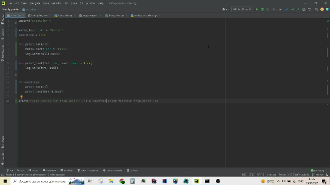

# FastPy

FastPy is a statically typed programming language with pythonic syntax.

## About

FastPy is a new general purpose, multi-paradigm, high performance, statically typed programming language which have
pytonic intuitive syntax.

## Examples

- ["Hello, World"](examples/hello_world.fpy) program:

```python
# Just a comment :D

log('Hello, World!')  # print hello world
```

- ["Far Future"](examples/far_future.fpy) program:

```python
interface Car:
    public:
        fun __init__(name: str, weight: int): ...
		
		
        @property
        fun brand() -> str: ...
			
		
        @property
        fun name() -> str: ...
			
			
        @property
        fun weight() -> int: ...
		

class Tesla(Car): # Car implementation
    private:
        __name: str
        __weight: int
    public:
        fun __init__(name: str, weight: int):
            __name = name
            __weight = weight
		
		
        @property
        fun brand() -> str:
            return 'Tesla'
			
		
        @property
        fun name() -> str:
            return __name
			
			
        @property
        fun weight() -> int:
            return __weight


fun car_factory(car_brand: str, name: str, weight: int) -> Car:
    match car_brand:
        case "Tesla":
            return Tesla(name, weight)
        default:
            return null


some_car: Car = car_factory("Tesla", "Model X", 2301) 
log(some_car.name) # Model X
log(some_car.weight) # 2301
```

*\*For more samples, see [examples directory](examples).*

## Features

- [x] Transpailable to C++. Therefore, compiled. Therefore, fast
- [x] Easy intuitive syntax, similar to Python
- [x] Statically typed
- [x] Easy expandable
- [x] Flexible, you can customize it for yourself or completely rewrite each component
- [x] Built-in logging system

## Customizing

That language is built in such a way that allows to support customizing at every stage of transpiling or interpreting. For more
info, see [customizing doc file](docs/Customizing.md).

## Highlighting

To enable syntax highlighting, see [highlighting doc file](docs/Highlighting.md).

## Requirements

To transpile and compile your program, you need to install the requirements.

### Windows

1) First, you need to install **[Python 3.10](https://www.python.org/downloads/release/python-3105/)**
2) Then install some libs:

```shell
pip install -r requirements.txt
```

3) Next, you need to install **[MinGW](https://sourceforge.net/projects/mingw/)** (optional, only used for compilation)

## Transpiling

*Usage:*

```shell
python main.py [-h] -s SOURCE [-t] [-o OUTPUT] [-c]
```

*Examples:*

- Transpile file **main.fpy** to C++ and save to **some_folder/src**:

```shell
python main.py -s main.fpy -t -o some_folder
```

- Transpile file **main.fpy** to C++ and save to **some_folder/src** and compile: 

```shell
python main.py -s main.fpy -t -c -o some_folder
```

*First run from IDE (script: [file](examples/first_run_from_ide.fpy)):*



## Licence

FastPy uses the MIT license. See the bundled [LICENSE](LICENSE) file for details.
