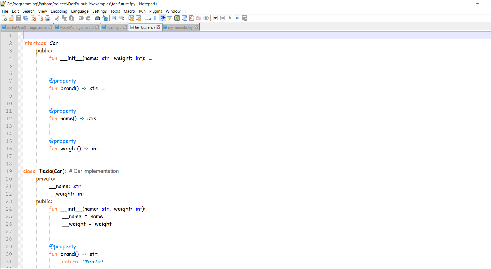
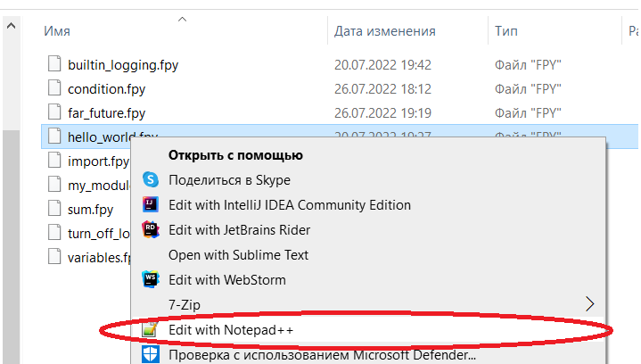
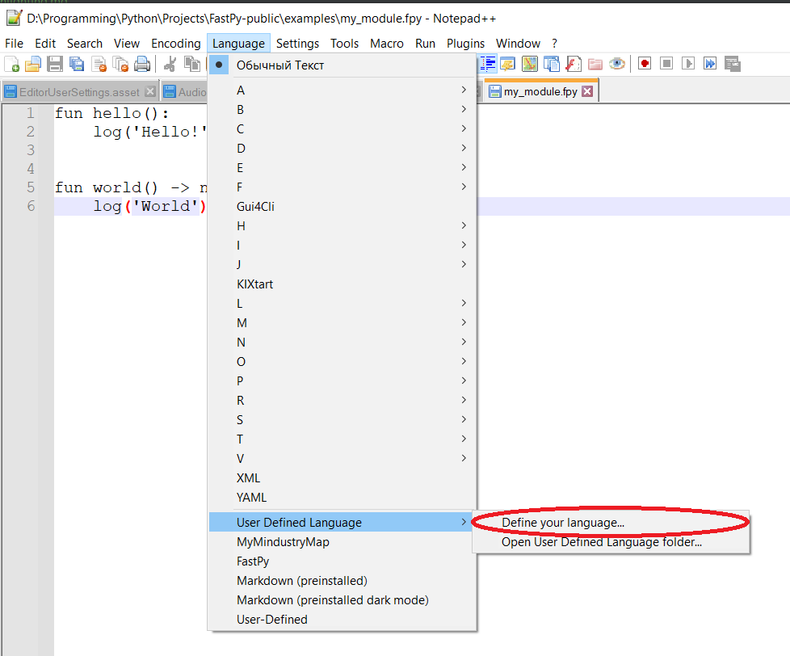
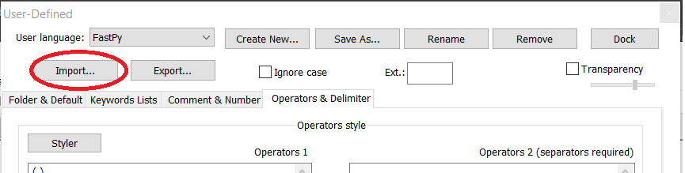
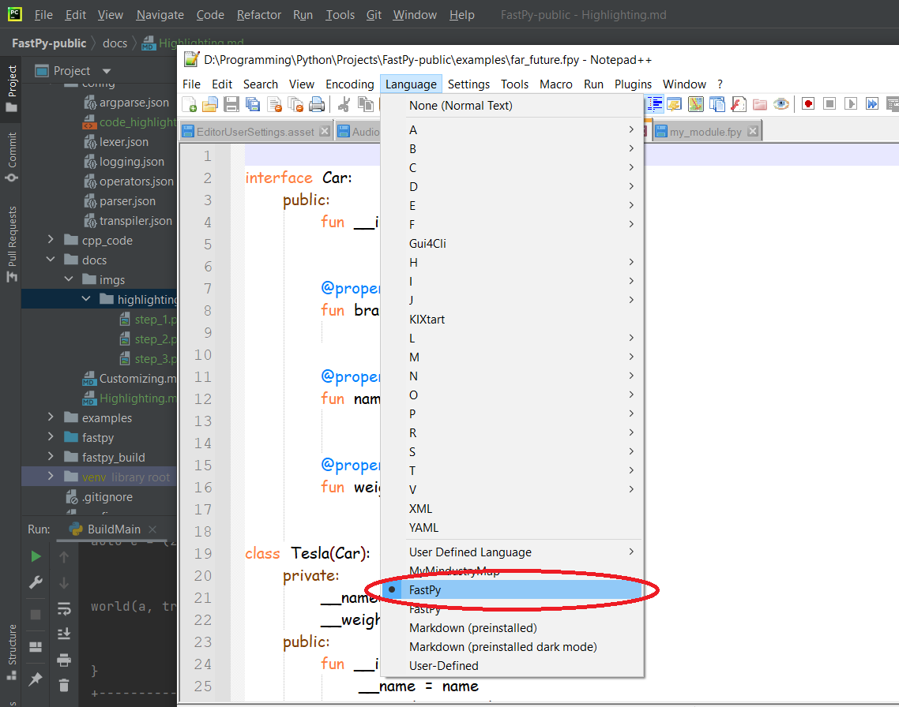

# Code highlighting

## Notepad++

If you want such highlighting, do follow steps:

1) Open .fpy source file in Notepad++

2) Go to tab **Language > User Defined Language > Define your language...**

3) Click **Import...** and select that [file](../config/code_highlighting.xml)

4)Then select FastPy in **Language** dropdown menu
